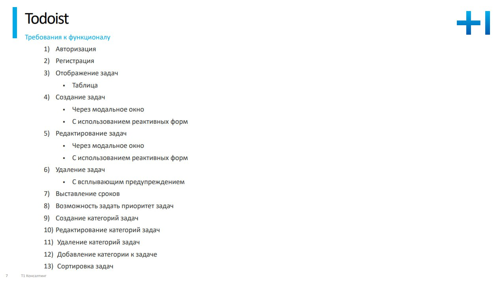

# Todoist
This web application allows to create the list of tasks and manage them.

This project was generated with [Angular CLI](https://github.com/angular/angular-cli) version 16.2.10.
## Features

## Development server

Run `ng serve` for a dev server. Navigate to `http://localhost:4200/`. The application will automatically reload if you change any of the source files.

